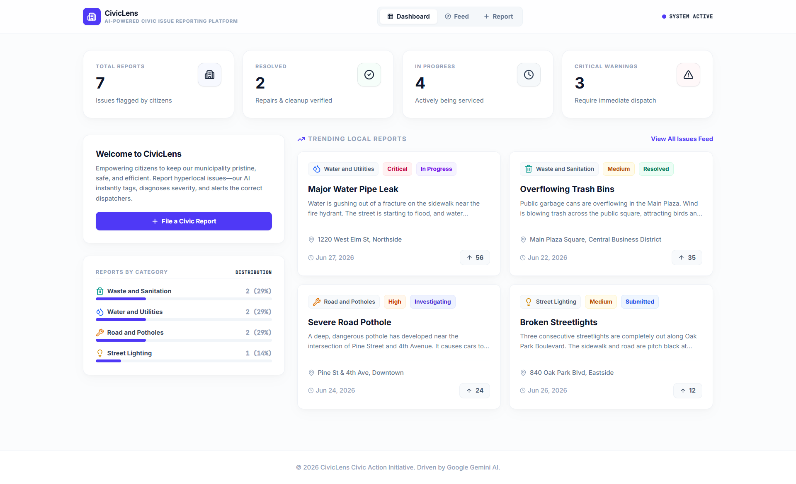
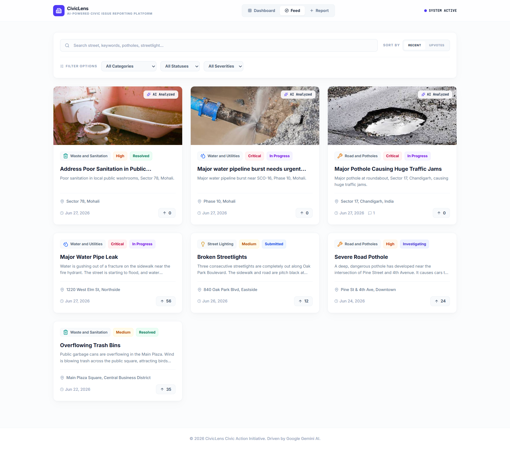
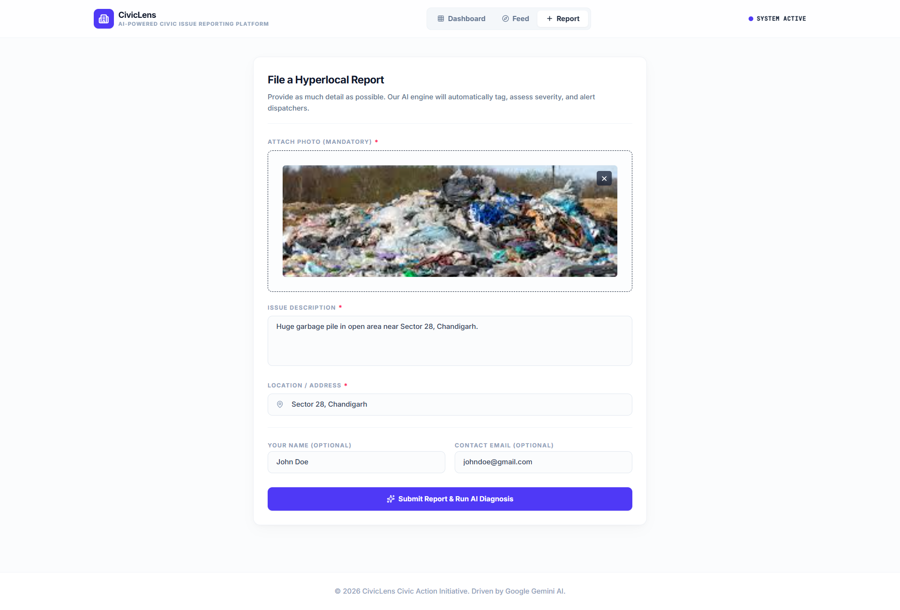
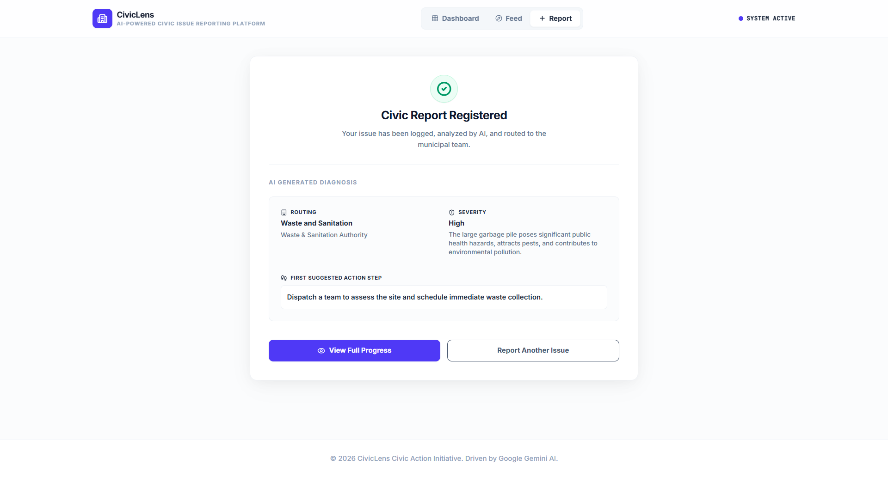
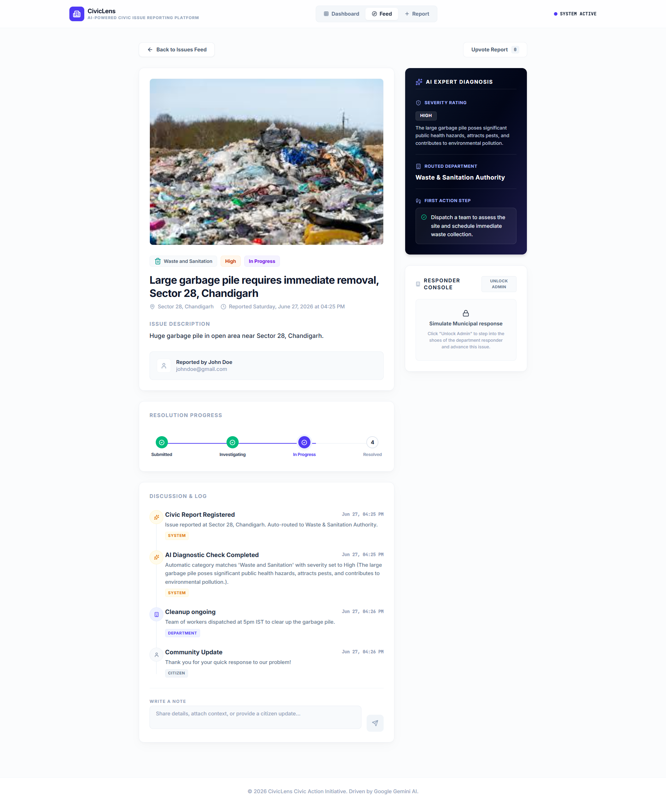

# CivicLens

## AI-Powered Civic Issue Reporting Platform

CivicLens is a full-stack AI-powered civic issue reporting system that enables citizens to report local infrastructure problems using images and descriptions. The platform uses Google Gemini AI to automatically classify issues, assess severity, recommend responsible departments, and generate actionable response steps.

---

## 🔗 Live Demo

[Live Link](https://community-hero-1099237776044.asia-southeast1.run.app/)

---

## 📌 Problem Statement

Urban civic issues such as potholes, waste dumping, water leaks, and streetlight failures are often reported through slow, unstructured, and inefficient systems. This leads to delayed responses, misclassification of issues, and poor prioritization by municipal authorities.

Citizens lack a fast, intelligent, and user-friendly system to report issues with proper context and automated routing.

---

## 💡 Solution Overview

CivicLens solves this problem by introducing an AI-powered civic reporting platform where users can:

- Upload an image of a civic issue
- Provide a short description
- Automatically receive AI-generated analysis including:
  - Issue category
  - Severity level
  - Suggested department
  - Recommended initial action

The system converts unstructured citizen reports into structured municipal action data.

---

## 🧠 Google Technologies Used

### Google Gemini API
- Natural language + image-based issue analysis
- Structured JSON response generation
- Automated civic classification

### Firebase Firestore
- Real-time NoSQL database for issue storage
- Dynamic dashboard updates

### Firebase Storage
- Secure image upload and retrieval system

### Google Cloud Run
- Deployment of full-stack application backend

### Google AI Studio
- Rapid prototyping and iterative development workflow

---

## 🛠️ Tech Stack

### Frontend
- React
- TypeScript
- Tailwind CSS
- Vite

### Backend
- Node.js
- Express.js

### Database & Storage
- Firebase Firestore
- Firebase Storage

### AI Integration
- Google Gemini 2.5 Flash

---

## 📸 Screenshots

### Dashboard


### View all Issues


### Report an Issue


### AI Analysis Result



---

## ✨ Key Features

### 🧠 AI-Powered Analysis
- Automatic classification of civic issues
- Severity prediction (Low, Medium, High, Critical)
- Suggested government department routing
- Actionable response generation

### 📸 Issue Reporting System
- Image + description-based reporting
- Optional name/email fields
- Real-time validation with modern UI feedback

### 📊 Dashboard System
- Categorized issue tracking
- Clean card-based UI
- Responsive layout for all devices

### ⚡ Smart Categorization
Supported categories:
- Road and Potholes
- Street Lighting
- Waste and Sanitation
- Water and Utilities
- Other

### 📱 Responsive Design
- Mobile-first UI
- Fully responsive across devices
- Tailwind CSS-based modern interface

### 🔄 Real-Time Backend Integration
- Firestore database integration
- Image storage via Firebase Storage
- Express backend API handling AI workflow

---

## ⚙️ System Architecture

User Flow:

1. User submits issue (image + description)
2. Frontend sends request to backend API
3. Backend processes request and calls Gemini AI
4. AI returns structured JSON:
   - category
   - severity
   - department
   - action steps
5. Backend stores data in Firestore
6. Dashboard fetches and displays categorized issues

---

## 📂 Project Structure

```

CivicLens/
│
├── src/                 # React frontend
├── server.ts            # Express backend
├── index.html           # App entry
├── vite.config.ts       # Vite config
├── firestore.rules      # Firebase rules
├── package.json         # Dependencies
├── tsconfig.json        # TypeScript config
└── README.md

````

---

## 📊 AI Classification Categories

- Road and Potholes  
- Street Lighting  
- Waste and Sanitation  
- Water and Utilities  
- Other  

---

## 🚀 Core AI Workflow

The AI system performs:

- Image + text understanding
- Civic issue classification
- Severity evaluation based on risk level
- Department mapping
- Action recommendation generation

Output format:

```json
{
  "category": "Road and Potholes",
  "title": "Pothole blocking main road",
  "severity": "High",
  "severityReason": "High traffic hazard risk",
  "suggestedDepartment": "Department of Public Works",
  "initialActionStep": "Dispatch repair team immediately"
}
````

---

## 🎯 Future Improvements

* User authentication (Firebase Auth)
* Issue status tracking system (Open → In Progress → Resolved)
* Admin dashboard for municipalities
* Map-based issue visualization
* Notification system for updates
* Analytics dashboard for civic insights

---

### 🏁 Setup Instructions

```bash
git clone https://github.com/<your-username>/CivicLens.git
cd CivicLens
npm install
npm run dev
```

### Environment Variables

Create a `.env` file:

```
GEMINI_API_KEY=your_api_key_here
FIREBASE_PROJECT_ID=your_project_id
```

---

## 👨‍💻 Project Summary

CivicLens transforms civic issue reporting into an AI-powered, structured, and automated workflow system. It bridges the gap between citizens and municipal services using modern web technologies and Google AI infrastructure.

The platform demonstrates full-stack capabilities including frontend development, backend API design, AI integration, database management, and cloud deployment.

---

## 🏆 Impact

* Reduces manual effort in civic reporting
* Improves issue classification accuracy
* Speeds up municipal response workflow
* Makes civic engagement more accessible and structured

---

## 📄 License

This project is built for hackathon and educational purposes.

---

## 📌 Author

 📅 Date Completed: July 27, 2026
 With ❤️ by [@erleen0307](https://github.com/erleen0307/)
